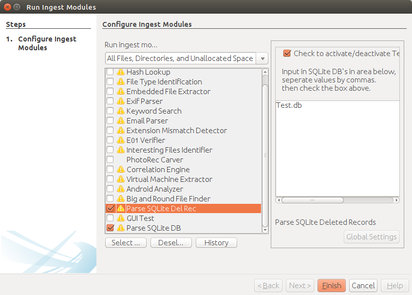

# Parse SQLite Databases Deleted Records
Parse SQLite Databases for records that no longer exists in the database.

## Install Process
This section will go over the different ways that you can install the SQLite DB Del Records Plugin.

### Only install SQLite DB Del Records Plugin
_This method is the only method that can be used on Linux or Mac._
1. To install the Parse SQLite DB Del Records plugin first you must [download a ZIP](https://github.com/markmckinnon/Autopsy-Plugins/archive/master.zip) file containing all of the plugins.  This ZIP file contains a number of Autopsy plugins.
2. [Unzip the ZIP file.](https://support.microsoft.com/en-us/help/14200/windows-compress-uncompress-zip-files)
3. Move the folder named Parse_SQLite_Del_Records to the plugin directory.
  * To figure out the plugin directory you can go to Tools > Python Plugins inside of the Autopsy Menu System and it should open the folder where the plugin should go.
4. Restart Autopsy if it is running.

### Executable Installer (Windows Only)
1. Download the [installer](https://github.com/markmckinnon/Autopsy-Plugins/releases/download/v1.0/Autopsy_Python_Plugins.exe).
2. Run the installer following the prompts.

## Running the Plugin
1. To run the plugin you can right click a folder inside of your datasource and run the Run Ingestion Modules options.
2. A popup will appear.  Select Parse SQLite Del Rec in the list of plugins.  Type the name of the DB file you are attempting to parse as well as press the checkbox.

3. Hit finish.
4. Your results should appear inside of Extracted Content on the main Autopsy screen.

## Need Help
If you are having problems running the software please create an [issue on GitHub](https://github.com/markmckinnon/Autopsy-Plugins/issues/new).
